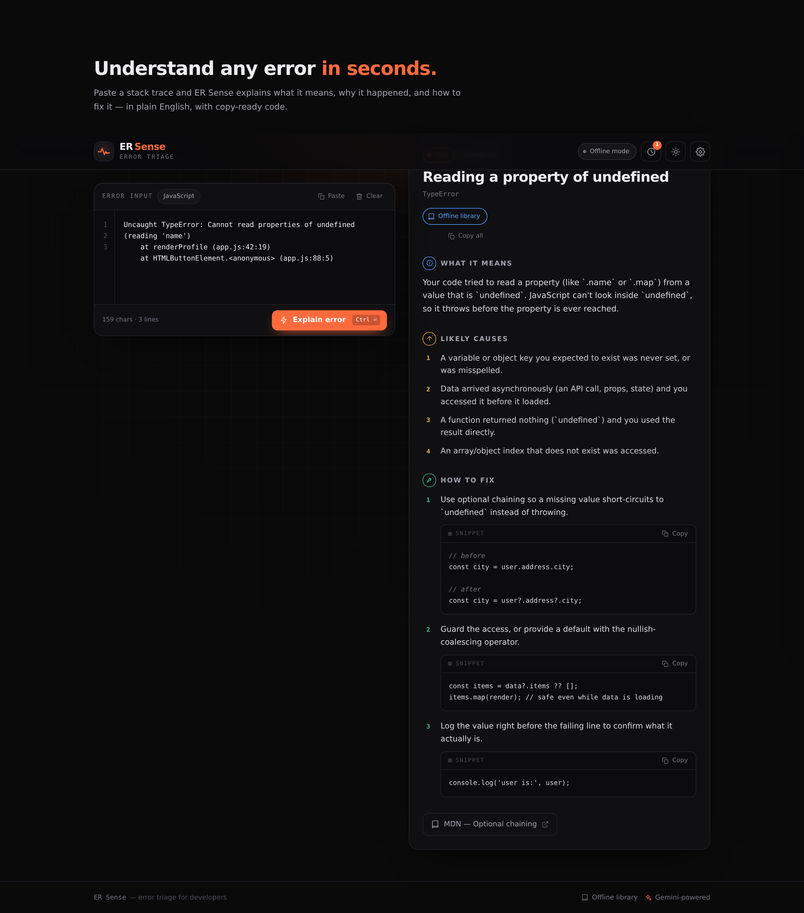

# ER Sense - Explain My Error

**Paste an error, a stack trace, or buggy code, and get a plain-English explanation, the exact bugs with line numbers, and a copy-ready fix.**

ER Sense is an AI-powered debugging assistant for developers. It auto-detects what you paste and runs in one of three modes, then breaks the problem down into what it means, why it happened, and how to fix it.

**[Live demo](https://vedantjaiswal001.github.io/ersense/)** &nbsp;·&nbsp; Built with React 19, Vite, Tailwind v4, and Google Gemini.



---

## Three modes, auto-selected

ER Sense reads your input and picks the right mode automatically:

- **Error Explanation** - paste a stack trace and get what it means, the root cause, the failing line, and how to prevent it.
- **Code Doctor** - paste source code with no error, and it finds every bug: a severity summary, one card per issue (line number, offending expression, why it's wrong, before -> after fix), and a "Fix All" corrected file.
- **Debug** - paste code *and* its error together for the most thorough pass: it explains the error, pins the failing line, and prioritizes every related issue.

## Features

- **Accurate line references.** The app numbers your source before sending it to the model and instructs it to cite only those numbers, so the "Line 4" badges are trustworthy - click one to jump to and highlight that line in the editor.
- **Syntax highlighting** in the editor and every code block (a hand-built, dependency-free tokenizer).
- **Bring-your-own-key AI.** Add a free Google Gemini key; it is stored only in your browser and sent directly to Google, so there are no secrets in this repo and no backend to run. The app auto-discovers a working free model for your key, so it keeps working as Google rotates model versions.
- **Works offline.** A curated library of common errors answers instantly with no key and no network.
- **History** of past analyses, **light / dark themes**, a "vitals scan" animation while analyzing, and the `Ctrl/Cmd + Enter` shortcut.

---

## How it works

1. The input is classified (error / code / debug) and parsed for language, framework, and error type.
2. If a Gemini key is present, ER Sense sends a structured prompt and renders the returned JSON (issues, fixes, corrected code). If the AI call fails - bad key, rate limit, offline - it gracefully falls back to the offline library and tells you why.
3. With no key, the offline knowledge base matches the error and returns a curated answer.

Nothing is proxied through a server. The API key never leaves the browser except to talk directly to Google.

---

## Get a free Gemini API key (about a minute)

1. Open [Google AI Studio](https://aistudio.google.com/apikey) and sign in with a Google account.
2. Click **Create API key** (no credit card required) and copy it.
3. In ER Sense, open **Settings**, paste the key, press **Test key**, then **Save**.

The free tier is generous and resets daily. Your key stays in your browser's local storage.

---

## Run locally

Requires Node 18+.

```bash
npm install
npm run dev
```

Open the URL Vite prints (default `http://localhost:5173`).

Other scripts: `npm run build` (production build to `dist/`), `npm run preview` (serve the build), `npm run lint`.

---

## Deploy (free)

ER Sense is a static single-page app - the `dist/` folder can be hosted anywhere.

- **GitHub Pages:** build with a relative base (already configured) and publish `dist/` to a `gh-pages` branch.
- **Vercel / Netlify:** import the repo, framework preset **Vite**, build command `npm run build`, output `dist`.

No environment variables are needed - the API key is entered in the app at runtime.

---

## Tech stack

- **React 19** + **Vite** for a fast single-page app.
- **Tailwind CSS v4** with CSS-first design tokens and light / dark theming via CSS variables.
- **Google Gemini API**, called directly from the browser with an auto-selected free Flash model.
- No UI framework and no icon dependency - the components, icons, and syntax highlighter are hand-built.

---

## Project structure

```
src/
  App.jsx                 # state + layout orchestration
  index.css               # design system (tokens, themes, motion, syntax colors)
  lib/
    classify.js           # error / code / debug detection + line numbering
    parseError.js         # language / framework / error-type detection
    offlineDb.js          # curated offline knowledge base + matcher
    gemini.js             # bring-your-own-key client with auto model discovery
    analyze.js            # orchestrator (AI -> offline fallback)
    storage.js            # localStorage helpers (key, history, theme)
    severity.js           # shared severity -> label/color map
    samples.js            # example inputs for the empty state
  components/
    Header, Footer, Logo
    ErrorInput            # editor with line numbers, highlighting, scan line
    ResultPanel           # explanation / issues / fix-all
    IssueCard, IssuesSummary
    Highlighted           # dependency-free syntax highlighter
    ResultStates          # empty + loading states
    SettingsModal         # API key + instructions
    HistoryPanel          # saved analyses
    CodeBlock, Badges, CopyButton, icons
```

---

## Privacy

ER Sense has no backend and collects nothing. Your API key and history live only in your browser's local storage. In AI mode, the text you submit is sent directly to Google's Gemini API to generate the explanation.

## License

MIT - see [LICENSE](LICENSE).

---

Made by **Vedant Jaiswal**.
